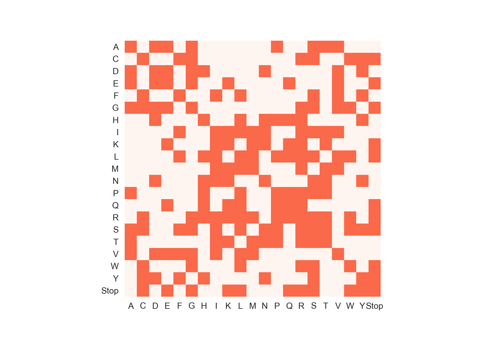
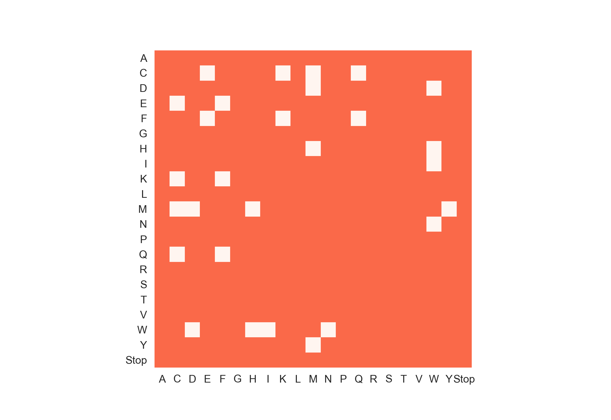

Trying to play around some code surrounding evolution.

With a single mutant library, 44% of all amino acid changes are covered.

Otherwise, with a double mutant library, 94% of all amino acid changes are covered.
